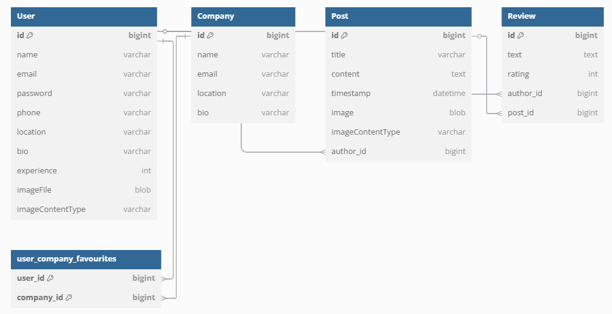

[](https://classroom.github.com/a/Jd7ILUgB)

# 🌐 JobMatcher

> JobMatcher is a web application that connects users with companies through a system of likes, posts, and reviews. Each user can explore companies and discover opportunities. It is designed to boost business visibility and encourage direct engagement between users and organizations.

🔒 **See the [Security Configuration](#-security-configuration) section below for deployment instructions.**

---

## 📘 Entities

The application manages the following main entities, which can be created, edited, viewed, and deleted:

- **User**
- **Company**
- **Post**
- **Review**

---

### 🔄 Key Relationships

- **User** ⇄ **Company** through 'likes' → N:M relationship  
- **User** → creates multiple **Posts** → 1:N relationship  
- **User** → writes multiple **Reviews** → 1:N relationship  
- **Post** → can have multiple **Reviews** → 1:N relationship

---

### 🔐 User Permissions

| User Type   | Permissions                                                                                |
|-------------|--------------------------------------------------------------------------------------------|
| GUEST       | Can navigate through the matches and blog pages.                                           |
| USER        | Can create and edit their own posts, give likes and manage their profile.                  |
| ADMIN       | Can create, edit, and delete companies, users, posts, reviews, and manage their profile.   |

---

### 🧑‍💻 Example Users for Testing

The following users are available for testing purposes:

| Username         | Email                    | Password    | Roles        |
|------------------|--------------------------|-------------|--------------|
| Admin User       | admin@example.com        | password123 | USER, ADMIN  |
| Test User 1      | testuser1@example.com    | password123 | USER         |
| Test User 2      | testuser2@example.com    | password123 | USER         |


> 🔒 All passwords are set to `password123` for testing convenience.

---

### 🔐 Security Configuration

> For evaluation purposes, the application has been secured using best practices to prevent unauthorized access and common web vulnerabilities.

- **Database access is restricted**:  
  The application does **not use the `root` user**.  
  Instead, it connects with the restricted user: `jobmatcher_user`.

- **Environment variables required**:  
  To run the application with MySQL, two environment variables must be defined:

  ```bash
  DB_USER=jobmatcher_user
  DB_PASS=Jobmatcher_123
  mvn clean spring-boot:run
  ```

  In PowerShell, use:

  ```powershell
  $env:DB_USER="jobmatcher_user"
  $env:DB_PASS="Jobmatcher_123"
  mvn clean spring-boot:run
  ```

---

### 🖼️ Images

The following entities include associated images:

- **User**: Profile picture  
- **Post**: Main post image  

---

### 🗂️ Database Schema



This diagram illustrates the main entities of the application and their relationships, including a many-to-many association between users and companies through likes.


---

## 👥 Development Team

| Name                 | University Email                    | GitHub Username      |
|----------------------|-------------------------------------|----------------------|
| Daniel Martín Muñoz  | d.martinm.2023@alumnos.urjc.es      | @dmartinm2023        |
| Carlos Marrón Benito | c.marron.2023@alumnos.urjc.es       | @CarlosMarronBenito  |
| Hector Julián Alijas | h.julian.2023@alumnos.urjc.es       | @h-julian            |
| Álvaro Mota Lucena   | a.mota.2023@alumnos.urjc.es         | @4lvaro18            |

---


### 👤 Daniel Martín Muñoz

#### Tasks completed:
- Session management
- Implementation of rich text
- Security in cookies and tokens
- Configuration of SecurityConfig

#### Top 5 commits:
1. [`API and web bugs fixed`](https://github.com/DWS-2025/project-grupo-18/commit/0e94849eacaf90333dc975f3a1820cd6e7600d57)
2. [`quill.js implemented`](https://github.com/DWS-2025/project-grupo-18/commit/c03a854a8001e3f8b7809655a4071cacb7ba8caa)
3. [`Logout added`](https://github.com/DWS-2025/project-grupo-18/commit/50155efb866e5bdf4f6e1f61bd30e44601d710d3)
4. [`Delete and close session`](https://github.com/DWS-2025/project-grupo-18/commit/c3bd10afe25f89dbdd1528636e3132df65b1cef0)
5. [`Cookies same-site strict`](https://github.com/DWS-2025/project-grupo-18/commit/bf83efeeb3f0648aec890c887ebe03f855d15eac)

#### Top 5 files contributed to:
- `src\main\java\es\grupo18\jobmatcher\security\SecurityConfig.java`
- `src\main\java\es\grupo18\jobmatcher\controller\rest\PostRestController.java`
- `src\main\java\es\grupo18\jobmatcher\service\UserService.java`
- `src\main\java\es\grupo18\jobmatcher\controller\rest\UserRestController.java`
- `src\main\java\es\grupo18\jobmatcher\security\jwt\AuthResponse.java`

### 👤 Carlos Marrón Benito

#### Tasks completed:
- Implementation of the CSRF token
- AJAX security measures
- Security enhancements with Content Security Policy
- User roles added

#### Top 5 commits:
1. [`ContentSecurityPolicy`](https://github.com/DWS-2025/project-grupo-18/commit/ce6dd1b4732f0574c42c3bd14ef075b39afa951c)
2. [`Roles added`](https://github.com/DWS-2025/project-grupo-18/commit/825f8ac135e32b2f657de3f34a80bd5e0d17b91a)
3. [`Security on CSRF and AJAX`](https://github.com/DWS-2025/project-grupo-18/commit/8f3f3070a7ba9e8c3fb24235aa5b3bc954c4bf95)
4. [`API fixing`](https://github.com/DWS-2025/project-grupo-18/commit/a2feab4b44a23ce018b498745b3a77ebd9dd0d25)
5. [`Update config redirection`](https://github.com/DWS-2025/project-grupo-18/commit/3976501c9f33680214070c1358e3e2507497e8de)

#### Top 5 files contributed to:
- `src\main\resources\static\js\usersAjax.js`
- `src\main\resources\static\js\companiesAjax.js`
- `src\main\java\es\grupo18\jobmatcher\security\CSRFHandlerConfiguration.java`
- `src\main\resources\templates`
- `src\main\java\es\grupo18\jobmatcher\controller\rest`


### 👤 Héctor Julián Alijas

#### Tasks completed:
- Roles in the database.
- Security and validations for images
- Encoded passwords
- Role-based distinction for CV uploads
- User management for the admin

#### Top 5 commits:
1. [`Basic Users`](https://github.com/DWS-2025/project-grupo-18/commit/db9fe8cda88e73cbbb85488de4bdc5a122e664f7)
2. [`Roles for DB.`](https://github.com/DWS-2025/project-grupo-18/commit/378e84b49614785e6d539c3c3dc5ccd214082133)
3. [`Password encoder`](https://github.com/DWS-2025/project-grupo-18/commit/080349f8187101e816012c66bb37feb0d881c0c2)
4. [`Security and roles for CV`](https://github.com/DWS-2025/project-grupo-18/commit/e83aced4c8b287751bf2ba6ae3b7a3d4190ed7bb)
5. [`Image Security for Post`](https://github.com/DWS-2025/project-grupo-18/commit/ef2574ae2f5e3eb9d919384dccee2cc6682b68c6)

#### Top 5 files contributed to:
- `src\main\java\es\grupo18\jobmatcher\controller\web\ProfileController.java`
- `src\main\java\es\grupo18\jobmatcher\service\UserService.java`
- `src\main\java\es\grupo18\jobmatcher\service\PostService.java`
- `src\main\java\es\grupo18\jobmatcher\controller\web\UserController.java`
- `db-mysql\reset-db-full-fase3.sql`


### 👤 Álvaro Mota Lucena

#### Tasks completed:
- Implementation of logic for user registration and login in the API.
- Development of functionality to upload and download PDF files.
- Testing for potential SQL injection and XSS vulnerabilities.
- Attribute sanitization and resolution of known security vulnerabilities.

#### Top 5 commits:
1. [`Added REST controllers for login and register`](https://github.com/DWS-2025/project-grupo-18/commit/35684272f7d9aa680695b152f42f781b87771799)
2. [`Added option to upload PDF file to profile.`](https://github.com/DWS-2025/project-grupo-18/commit/ba6d6b9ccc42f54dc417bec6b1f17a5038e29137)
3. [`Known XSS patched.`](https://github.com/DWS-2025/project-grupo-18/commit/0a272a76a8655b25c2727e77859d665769adfda4)
4. [`Resolved more known XSS and fortified API REST`](https://github.com/DWS-2025/project-grupo-18/commit/0c5dc0de6fbc25097297c7cc6f3f8f70b251cf69)
5. [`Fixed csrf problem.`](https://github.com/DWS-2025/project-grupo-18/commit/08eb290385ff5264defa7980edc68d6d303419fd)


#### Top 5 files contributed to:
- `src\main\java\es\grupo18\jobmatcher\controller\rest\LoginRestController.java`
- `src\main\java\es\grupo18\jobmatcher\controller\rest\RegisterRestController.java`
- `src\main\java\es\grupo18\jobmatcher\controller\web\RegisterWebController.java`
- `src\main\java\es\grupo18\jobmatcher\controller\web\ProfileController.java`
- `src\main\java\es\grupo18\jobmatcher\security\SecurityConfig.java`

---

## 📬 Postman Collection

You can test the API using the included Postman collection included in path: src\main\resources\static\json\api.postman_collection.json:  
[`api.postman_collection.json`]

This file contains sample requests for:
- Creating, editing, deleting and retrieving users, posts, reviews and companies.
- Pagination and dynamic filtering.